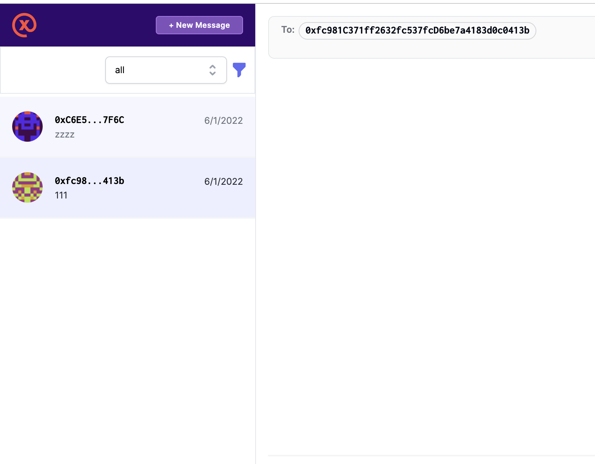

## W3NS - Web3 NFT Social Platform

Web3 NFT Open Platform For Novice Web3 Users.

Currently with two main Features:

* Linktree like home page for every wallet address that user can follow/unfollow it, and chat with the wallet address
* chat system have a full functions filter logic that support with CyberConnect data and wallet address's onChain data

<table>
  <tr>
    <td valign="top"></td>
    <td valign="top"></td>
    <td valign="top"></td>
  </tr>
  <tr>
    <td valign="top"></td>
    <td valign="top"></td>
    <td valign="top"></td>
  </tr>
</table>

## Deploy Information and Demo Video

* [Keynote](./Web3NFT.Social.pdf)
* Main App Deploy Url: <https://dev.web3nft.social>
* Chat App(base on the XMTP chat app code)
  * Deploy Url: <https://chat.web3nft.social>
* [Some of the screenshots](./screenshot)
* Video Demo on Loom
  * [Video demo for Main Application and Chat Application](https://www.loom.com/share/f49d8e0c76d14e8eb8390804026b1a3b)
  * [Video demo for deploy nft with ChainIDE](https://www.loom.com/share/54d8abfc2e4b44798c9c4f759514faa3)
  * [Video demo for deploy nft marketplace with ChainIDE](https://www.loom.com/share/14213d80587349e68c5db461b2cb8e5f)
* [front-end code](./frontend)
* [contract code](./contract)
* Main application frontend deployed
  * [Arweave](#)
  * [Vercel](https://web3nft.social)
  * [Meson](#)
* Chat App
  * Currently build base on the XMTP example chat app: [Pull Request](https://github.com/NftTopBest/example-chat-react-gitcoin-hackathon/pull/1)
  * Will build a full function chat && work application in to main Application soon
* Contract deployed
  * [Mumbai](#)
    * [NFT Deploy](https://mumbai.polygonscan.com/tx/0x6363ce4665a2f2473be38631a72b0240e0d79dfe3a3032a462a4e97deb3319b1)
    * [NFT Marketplace Deploy](https://mumbai.polygonscan.com/tx/0x60b4235af6c0d4bcddf66fbe2d2cd55d40bba628ffeeae3805ce88f390512ae1)
  * [Near: Aurora](#)
  * [Moonbeam](#)

<h2>Technologies used</h2>

* BlockChain Network
  * [x] Polygon Mumbai testnet: [NFT Deploy](https://mumbai.polygonscan.com/tx/0x6363ce4665a2f2473be38631a72b0240e0d79dfe3a3032a462a4e97deb3319b1), [NFT Marketplace Deploy](https://mumbai.polygonscan.com/tx/0x60b4235af6c0d4bcddf66fbe2d2cd55d40bba628ffeeae3805ce88f390512ae1)
  * [ ] Near: Aurora
  * [ ] Moonbeam
* Smart Contract Dev Env
  * [x] Hardhat
  * [x] ChainIDE
* RPC endpoints
  * [x] Infura
* Front-end hosting && image assets && CDN
  * [x] Vercel
  * [x] IPFS
  * [x] Meson
* User profiles / Blog posts store / Albumn Store / Permission Control
  * [x] Ceramic
  * [x] Self.ID
  * [x] LIT
  * [x] Bundlr
* Social Graph
  * [x] CyberConnect
  * [ ] KNN3
* Chat
  * [x] XMTP
* Application Tech Stack
  * [x] TailwindCSS
  * [x] Vue3
  * [x] Pinia (state store)
  * [x] PWA
  * [x] Vue-i18n
  * [x] Villus (gql && pinia binding lib)
  * [x] Vite2

<h2>Application Features </h2>

* Support all web2 social platform login
  * Easier for new Web3 users (thanks to the Web3Auth)
  * Login by many social platforms
  * Login by metamask/walletconnect
  * While storing data to Ceramic, will trigger Self.ID login too
* CyberConnect
  * Follow/unfollow actions
  * Followers list
  * Followings list
* Profile data save on Ceramic
* Web3 LinkTree
  * Users can add many social platform links to their W3NS home page
  * Data stored on Ceramic
  * Data permission control by LIT
* Search any address to show the Web3 things
  * Use KNN3 to get the NFT user information
* [WIP] Web3 Instagram Clone
  * With LIT to have content permission control (user must mint poster's NFT to have access to the page)
* [WIP] Web3 Blogger Clone
  * With LIT to have content permission control (user must mint poster's NFT to have access to the article)
* [WIP] Anyone can create an NFT marketplace without code to earn an exchange fee

<h2> Hackathon Tracks Bounty </h2>

### XMTP Bounty [#1](https://gitcoin.co/issue/28887), [#2](https://gitcoin.co/issue/28892), [CyberConnect](https://gitcoin.co/issue/28881) and [Infura](https://gitcoin.co/issue/28876)

* Gate messages with CyberConnect and LIT
  * User can filter by CyberConnect Social Data: friends, followings, followers
  * User can pick the `all` filter that means all the conversations will show up event they do not include in the CyberConnect Social Data
  * User can add LIT control filter too
    * User can select which chain to query for the conditions below
    * User can add ETH, ERC20, ERC721, ERC777, ERC1155 token filters with contract address, comparators (<,<=, =, >=, >), and number
    * All of conditions can be `Intersection` or `Union`
    * User hit the `Calculate with LIT` button will trigger query with LIT and also show the calculate result for each condition and the final result
    * The calculate result will be `intersection` with the CyberConnect Social Data
* In the messages list, user can click on the avatar to go to the [W3NS](https://web3nft.social/0xC6E58fb4aFFB6aB8A392b7CC23CD3feF74517F6C) home page to check the user's more detail social informations
  * User can follow / unfollow some one on W3NS home page
  * User can check someone's followers / followings (something like Instagram)
  * User can click on the `Chat` button to jump to the XMTP application to chat with the user
* use the Infura as rpc service

### [ChainIDE Bounty](https://gitcoin.co/issue/28895), [Polygon](https://gitcoin.co/issue/28870)

* We deploy two contract with ChainIDE
* NFT Contract
  * use the ERC721A to save gas fee while mint multiple NFTs
  * can paused anytime
  * can setup whitelist
  * any address can bind to different number, that means different whitelist address can have different max mint amount of NFTs
  * can setup royalties
* NFT Marketplace Contract
  * everyone can use the marketplace to generate a new market that can earn exchange fee

### [Meson Network](https://gitcoin.co/issue/28891)

* try to deploy to Meson cdn, but while visiting index.html, it access the javascript file getting error, so I have to fallback to vercel.

## What's NEXT

* Build the UI that supports the user to mint anyone's page NFT
* Build the UI for the user to create their own NFT-D-Market that could earn an exchange fee without any coding skills
* Add traffic status information for every wallet address home page
* Finish the Blog and Instagram clone with Ceramic and LIT permission control
* Add $NTB token for the user to buy and work as the platform's coin (every activity require paying with $NTB)
* Add more functions that make the W3NS more like a Developer open platform that they do not re-invent the base gears and only need to focus on building application features (Think about Facebook Application Central but on the BlockChain Area!)
* Build the Chat UI in the Tailwind Style

## Contact Information

* Twitter: [Web3HackerNinja](https://twitter.com/web3hackerninja)
* Discord: [Web3Hacker.Ninja HD](https://discord.gg/34rHGATcHy)
